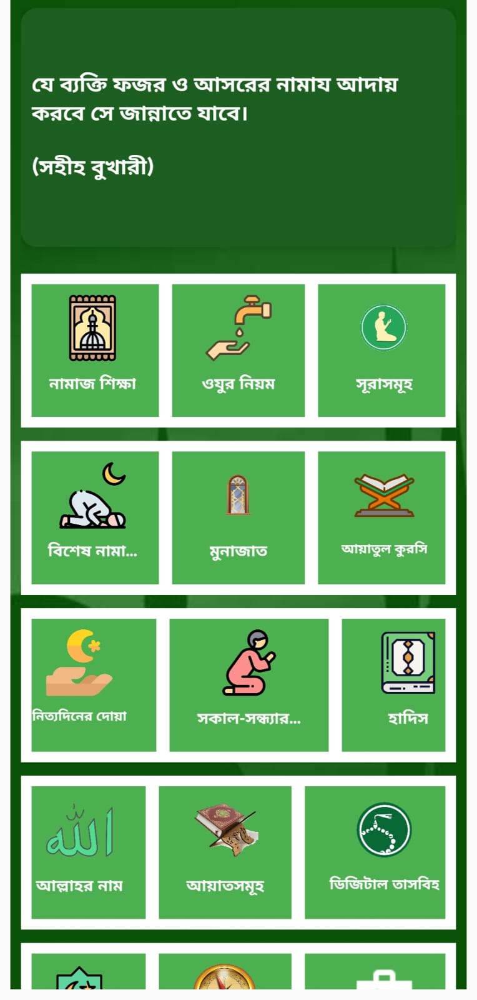
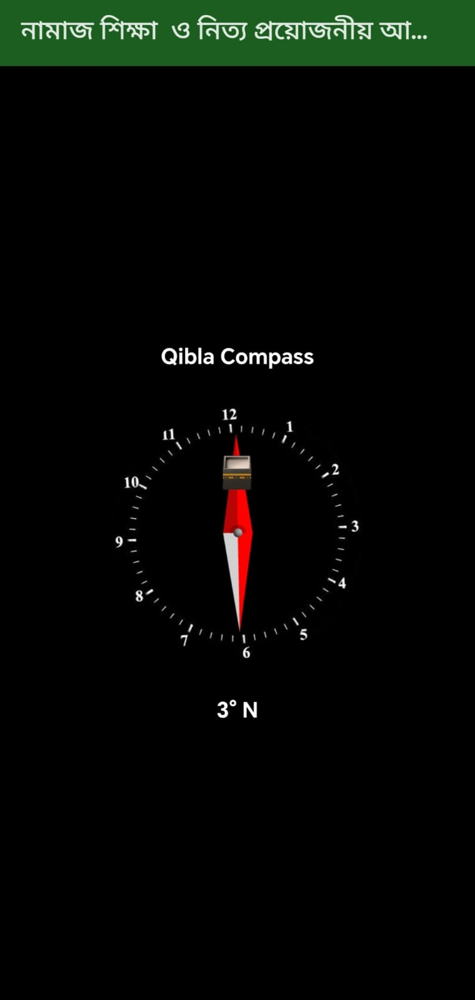

# 🕌 নামাজ শিক্ষা ও নিত্য প্রয়োজনীয় আমল  
_A complete Bangla guide for learning Salah and daily Islamic practices._

---

## 📖 Overview

**নামাজ শিক্ষা ও নিত্য প্রয়োজনীয় আমল** is a beautifully designed, offline Islamic app tailored for Bangla-speaking users. It combines essential prayer guidance, daily duas, Quranic verses, Hadiths, and more — all in one lightweight and beginner-friendly app. Built with performance in mind, it works seamlessly even without internet access.

---

## ✨ Key Features

- 🧎‍♂️ Step-by-step **Salah (Namaz) guide**  
- 💧 Complete guide to **Wudu (Ablution)**  
- 📖 **Essential Surahs** for prayer  
- 🤲 **Duas** and **Munajats** required for Salah  
- 📿 **Digital Tasbih** counter  
- 🌅 **Morning & Evening Azkar (Daily Remembrances)**  
- 🧭 **Qibla Compass** for accurate direction  
- 🖋️ **99 Names of Allah (Asmaul Husna)** with virtues  
- 🕋 **Ayatul Kursi** with Bangla translation  
- 📘 **Virtues of selected Surahs**  
- 🕌 **Daily Islamic practices & important duas**  
- 📚 **Hadiths & Quranic verses**  
- 🧎‍♀️ **Sayyidul Istighfar** and other recommended daily supplications  

---

## 🔧 Special Functionalities & Architecture

- 📄 **Custom PDF Reader** for smooth viewing of religious texts  
- 📴 Full **offline access** — no internet needed  
- 🧠 **MVVM architecture** for clean, maintainable code  
- 🔗 **In-app navigation system** for a seamless user experience  

---

## 🛠️ Tech Stack

- **Language:** Java  
- **IDE:** Android Studio  
- **Library:** iText PDF  
- **Architecture:** MVVM Pattern  
- **Platform:** Android  

---

## 📸 Screenshots

| Salah Guide | Digital Tashbee Counter | Qibla Compass |
|-------------|------|-------------------|
|  |  |  |

---

## 🛡️ Important Notice

⚠️ **Security Notice:**  
Only screenshots and a portion of the source code are provided in this repository to protect the full application.

For access to the complete version, please contact the developer:

📧 **mkt9319@gmail.com**

---

## 🙋 Contact

**Developer:** Minhajul Khan  
📧 Email: mkt9319@gmail.com

---

## 📄 License

This project is licensed under the [MIT License](LICENSE).

